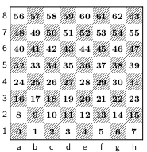

# Malfunctioning Beads

## Description
This is a stego challenge where the flag is hidden in the moves of a chess game.

## Solution
A chess board has 64 squares, do you know what else has 64 of something? base64! So I wrote a script to convert the moves to base64 and then decode it.
I used this table for the conversion:



And then wrote a simple script to convert the moves to base64:

```python
import chess
import chess.pgn
import sys
import base64

pgn = open(sys.argv[1])

game = chess.pgn.read_game(pgn)
base64_mapping = "ABCDEFGHIJKLMNOPQRSTUVWXYZabcdefghijklmnopqrstuvwxyz0123456789+/"

result = ""

for move in game.mainline_moves():
    thing += base64_mapping[move.to_square]

print(base64.b64decode(thing))
```

Which gives us the flag: `wh4T|F.h@Nz-Ch34ted.bY.BrinG|ng-1N-eXtR@_c#esz-P!3ceZ-!N H!$-pOCKe75 4nD P|4C3D_7hEM.0N.T#3 BO4rd_WHeN N00ne.w@5_L00k!n6?|1`
